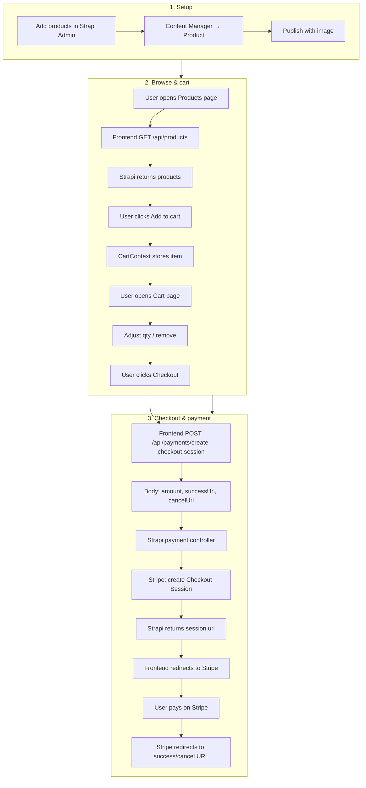
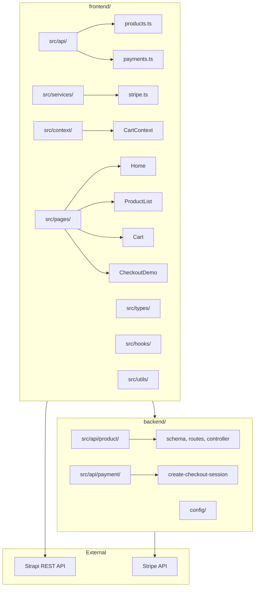

# Architecture & flow

High-level view of the DEMO project: how data and requests move from Strapi → frontend → Stripe.

## End-to-end flow (Mermaid)

```mermaid
flowchart LR
  subgraph Strapi["Strapi (backend)"]
    Admin[Admin UI]
    ProductAPI["/api/products"]
    PaymentAPI["/api/payments/create-checkout-session"]
    Admin --> ProductAPI
  end

  subgraph Frontend["React (frontend)"]
    Products[Products page]
    Cart[Cart page]
    Checkout[Checkout]
    CartCtx[CartContext]
    Products --> CartCtx
    Cart --> CartCtx
    Checkout --> CartCtx
  end

  subgraph Stripe["Stripe"]
    Session[Checkout Session]
    Pay[Payment UI]
    Session --> Pay
  end

  ProductAPI -->|GET products| Products
  Products -->|Add to cart| CartCtx
  Cart -->|View / edit| CartCtx
  Checkout -->|POST cart total| PaymentAPI
  PaymentAPI -->|Create session| Session
  PaymentAPI -->|{ url }| Checkout
  Checkout -->|Redirect| Pay
  Pay -->|Success / Cancel URL| Frontend
```

## Detailed user + system flow (Mermaid)



## Repo / module layout (Mermaid)



## Flow in words

1. **Products** – Strapi Admin → Content Manager → Product (name, slug, price, description, image). Frontend fetches via `GET /api/products`.
2. **Cart** – React CartContext holds items; Products page “Add to cart”, Cart page view/edit, Checkout uses cart total.
3. **Checkout** – Frontend calls `POST /api/payments/create-checkout-session` with amount, successUrl, cancelUrl; backend creates Stripe Checkout Session and returns `{ url }`; frontend redirects to Stripe.
4. **Payment** – User pays on Stripe (test card `4242 4242 4242 4242`); Stripe redirects back to success or cancel URL.

## Related docs

- **Flow & context:** [agent-context.md](agent-context.md)
- **Payment details:** [02-payment-gateway.md](02-payment-gateway.md)
- **Modular layout:** [04-modular-context-window.md](04-modular-context-window.md)
- **Schema:** [03-data-modelling-schema.md](03-data-modelling-schema.md)
